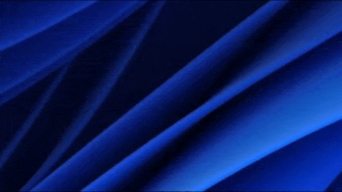

# Features

- This brand-new **changelog popup** that will now inform you of the last changes and new features after each update!

    _After close, you can show it again from top right menu or settings._

- App will now **auto update** at launch on Windows and MacOS.

    _You can also apply pending update immediately thanks to a button showing in app header._

- The **brightness overlay** allow you to see brightness changes on top of all applications like for volume on most operating systems. 

    _To enable it go to Interface settings. You will need to "bind" your screens to make it works._

https://github.com/super-bunny/lumos/assets/22429252/e14a4305-3876-40a6-9ab7-b699efe1c8dc

- Add a Material Dark theme.
    
    _You can change theme from interface settings._

# Fixes

- Fixed the app asking 2 times the monitor list to the operating system at startup, often leading to missing monitors in list.

- Fix bad behavior of app minimizing at startup.

# Miscellaneous

- Global shortcuts and brightness changes have been rate limited to avoid evil humans to spam it making the app panic under the pressure.

- App can be restarted from the tray menu (who will use it I don't know but it's here).

- Hide menu bar of app window.
